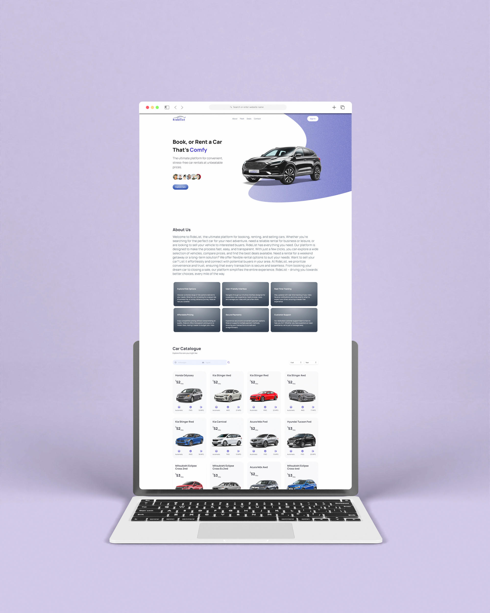

# RideList 🚗

Welcome to **RideList**, the ultimate platform for convenient, stress-free car rentals at unbeatable prices. Our goal is to provide users with a seamless experience, whether they’re looking to book, rent, or explore a range of vehicles. With a sleek interface and fast performance, RideList aims to make the process of renting a car simple, fast, and enjoyable.



---

## 🚀 Features

- **Smooth and dynamic user interface**: Provides a responsive and seamless experience across devices.
- **Car fleet exploration**: Users can browse available vehicles and select the one that fits their needs.
- **Scroll-based animations**: Smooth and visually appealing transitions.
- **Mobile navigation**: Easy navigation with a collapsible navbar for small screens.

---

## 🛠️ Tech Stack

- **Next.js**: A React-based framework for building fast and dynamic web applications.
- **TypeScript**: Adds type safety to the project, ensuring fewer errors and improved code readability.
- **Tailwind CSS**: A utility-first CSS framework for fast UI development with responsive designs.
- **Headless UI**: Unstyled, accessible components for building interactive UIs.
- **Aceternity UI**: For implementing customizable UI elements and components.
- **Framer Motion**: Provides animations and smooth transitions throughout the site.
- **React Hooks**: Manages state and logic for interactive elements.
- **Radial Gradient Effects**: Custom radial background images for a modern look.

---

## 🖼️ Project Mockup

Here's a glimpse of the user interface. You can find the complete mockup of the platform below:


---

## 📂 Getting Started

To get started with the project, follow these steps:

Clone the repository:
```bash
git clone https://github.com/AbdeljalilRajli/RideList.git
cd RideList
```

Install the dependencies:

```bash
npm install
```
Run the project locally:

```bash
npm run dev
```

## 🚧 Future Enhancements

Integration with payment gateways for car bookings.
User account management with secure login.
Adding AI-driven car recommendations based on user preferences.


