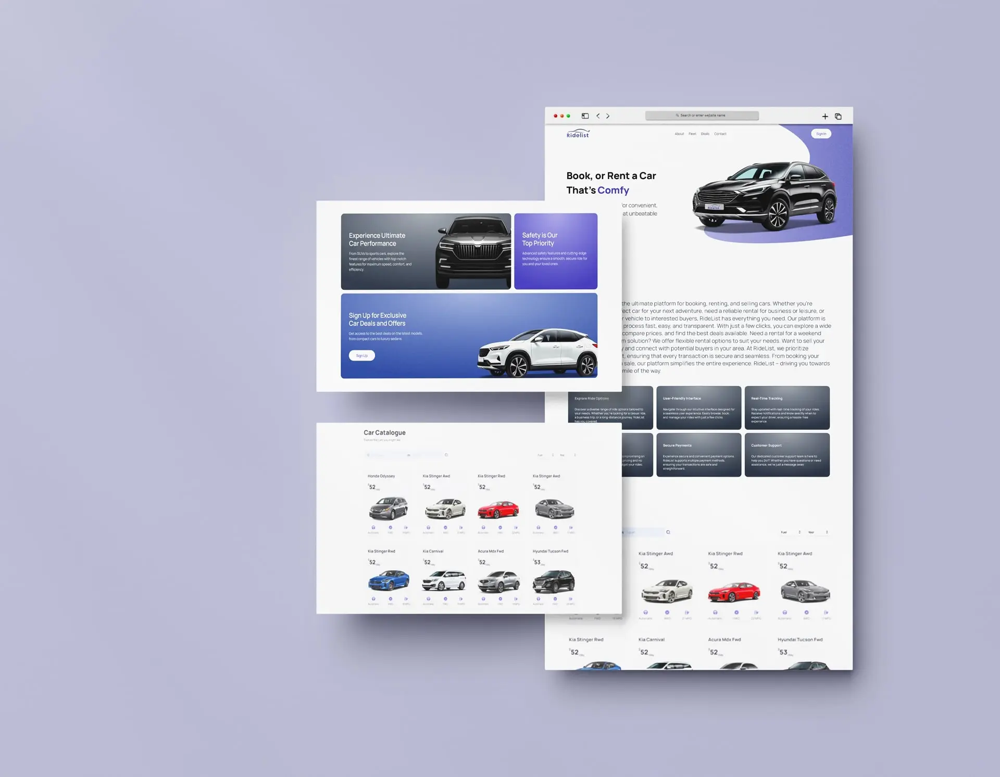

# RideList 🚗

Welcome to **RideList**, the ultimate platform for convenient, stress-free car rentals at unbeatable prices. Our comprehensive car rental management system provides both customers and administrators with a seamless experience, featuring advanced booking systems, user authentication, and powerful administrative tools.



---

## ✨ Key Features

### 🔐 **Authentication & User Management**
- **Firebase Authentication**: Secure email/password login and registration
- **Role-Based Access Control**: Separate dashboards for users and administrators
- **Protected Routes**: Secure access to user and admin areas
- **User Profiles**: Complete profile management with role indicators

### 🚗 **Car Fleet Management**
- **Extensive Fleet**: 25+ vehicles from 8 major brands (BMW, Mercedes, Audi, Tesla, etc.)
- **Advanced Filtering**: Filter by brand, model, fuel type, transmission, price range, seats, and year
- **Linked Dropdowns**: Smart brand → model filtering system
- **Individual Car Pages**: Detailed specifications, galleries, and booking forms
- **Real-time Search**: Instant filtering and search results

### 📅 **Booking System**
- **Integrated Booking Forms**: Complete rental booking with date selection
- **User Authentication Required**: Secure booking process
- **Booking Management**: Track all bookings with status updates
- **Revenue Tracking**: Automatic revenue calculation for confirmed bookings
- **Customer Information**: Complete customer details and contact information

### 👤 **User Dashboard**
- **Personal Booking History**: View all past and current rentals
- **Booking Status Tracking**: Monitor pending, confirmed, and completed bookings
- **Profile Management**: Update personal information and preferences
- **Responsive Design**: Optimized for all devices

### 🛠️ **Admin Dashboard**
- **Comprehensive Management**: Full control over bookings, users, and fleet
- **Revenue Analytics**: Real-time revenue tracking and reporting
- **Booking Status Control**: Update booking statuses and manage reservations
- **User Management**: View and manage customer accounts
- **Administrative Tools**: Complete backend management capabilities

### 🎨 **Modern UI/UX**
- **Transparent Homepage Navbar**: Elegant transparent navigation with glassy scroll effect
- **Professional Dropdowns**: Modern user profile dropdowns with role indicators
- **Responsive Design**: Perfect experience across desktop, tablet, and mobile
- **Smooth Animations**: Fluid transitions and hover effects
- **Modern Card Layouts**: Beautiful car cards with hover effects and detailed information

### 📱 **Mobile Optimization**
- **Mobile-First Design**: Optimized for mobile devices
- **Touch-Friendly Interface**: Large touch targets and intuitive gestures
- **Responsive Specifications**: Proper mobile layout for car details
- **Mobile Navigation**: Collapsible navigation with user dropdown

---

## 🛠️ Tech Stack

### **Frontend**
- **Next.js 14**: React framework with App Router and server-side rendering
- **TypeScript**: Type-safe development with enhanced IDE support
- **Tailwind CSS**: Utility-first CSS framework for rapid UI development
- **Framer Motion**: Smooth animations and transitions
- **Aceternity UI**: Modern UI components and effects

### **Backend & Database**
- **Firebase Authentication**: Secure user authentication and management
- **Firestore Database**: NoSQL database for storing users, bookings, and data
- **Firebase Security Rules**: Secure data access and validation

### **State Management**
- **React Context API**: Global state management for authentication
- **React Hooks**: Modern state management and side effects
- **Custom Hooks**: Reusable logic for authentication and data fetching

### **Development Tools**
- **ESLint & Prettier**: Code quality and formatting
- **TypeScript**: Static type checking
- **Git**: Version control and collaboration

---

## 📂 Getting Started

### Prerequisites
- Node.js 18+ and npm
- Firebase account for authentication and database

### Installation

1. **Clone the repository:**
```bash
git clone https://github.com/AbdeljalilRajli/RideList.git
cd RideList
```

2. **Install dependencies:**
```bash
npm install
```

3. **Firebase Setup:**
   - Create a Firebase project at [Firebase Console](https://console.firebase.google.com/)
   - Enable Authentication (Email/Password)
   - Create a Firestore database
   - Copy your Firebase config to `.env.local`:

```bash
# Firebase Configuration
NEXT_PUBLIC_FIREBASE_API_KEY=your_api_key
NEXT_PUBLIC_FIREBASE_AUTH_DOMAIN=your_auth_domain
NEXT_PUBLIC_FIREBASE_PROJECT_ID=your_project_id
NEXT_PUBLIC_FIREBASE_STORAGE_BUCKET=your_storage_bucket
NEXT_PUBLIC_FIREBASE_MESSAGING_SENDER_ID=your_sender_id
NEXT_PUBLIC_FIREBASE_APP_ID=your_app_id
```

4. **Run the development server:**
```bash
npm run dev
```

5. **Create your first admin user:**
   - Sign up through the app
   - Go to Firebase Console → Firestore
   - Find your user document and change `role` from `user` to `admin`

Open [http://localhost:3000](http://localhost:3000) to view the application.

---

## 🏗️ Project Structure

```
RideList/
├── app/                    # Next.js App Router
│   ├── car/[id]/          # Individual car detail pages
│   ├── fleet/             # Car fleet browsing page
│   ├── dashboard/         # User dashboard
│   ├── admin/dashboard/   # Admin dashboard
│   └── layout.tsx         # Root layout with metadata
├── components/            # Reusable React components
│   ├── auth/             # Authentication components
│   ├── ui/               # UI components
│   └── forms/            # Form components
├── contexts/             # React Context providers
├── lib/                  # Utility functions and Firebase config
├── constants/            # Static data and configurations
├── types/                # TypeScript type definitions
└── public/               # Static assets
```

---

## 🚀 Deployment

### Vercel (Recommended)
1. Push your code to GitHub
2. Connect your repository to [Vercel](https://vercel.com)
3. Add your Firebase environment variables
4. Deploy automatically

### Manual Deployment
```bash
npm run build
npm run start
```

---

## 📱 Features Overview

### For Customers:
- Browse extensive car fleet with advanced filters
- View detailed car specifications and galleries
- Secure account registration and login
- Book cars with integrated booking system
- Track booking history and status
- Responsive mobile experience

### For Administrators:
- Complete booking management system
- Real-time revenue tracking and analytics
- User account management
- Booking status updates and control
- Comprehensive admin dashboard
- Mobile-optimized admin tools

---

## 🔧 Configuration

### Firebase Security Rules
The app includes pre-configured Firestore security rules for:
- User authentication and authorization
- Role-based data access
- Secure booking data management

### Environment Variables
Required environment variables for production:
- Firebase configuration keys
- Optional: Analytics and monitoring keys

---

## 🤝 Contributing

1. Fork the repository
2. Create a feature branch (`git checkout -b feature/amazing-feature`)
3. Commit your changes (`git commit -m 'Add amazing feature'`)
4. Push to the branch (`git push origin feature/amazing-feature`)
5. Open a Pull Request

---

## 📄 License

This project is licensed under the MIT License - see the [LICENSE](LICENSE) file for details.

---

## 🙏 Acknowledgments

- **Firebase** for authentication and database services
- **Next.js** team for the amazing React framework
- **Tailwind CSS** for the utility-first CSS framework
- **Aceternity UI** for beautiful UI components
- **Framer Motion** for smooth animations

---

## 📞 Support

For support and questions:
- Create an issue on GitHub
- Contact: [your-email@example.com](mailto:your-email@example.com)

---

**Built with ❤️ by [Abdeljalil Rajli](https://github.com/AbdeljalilRajli)**


